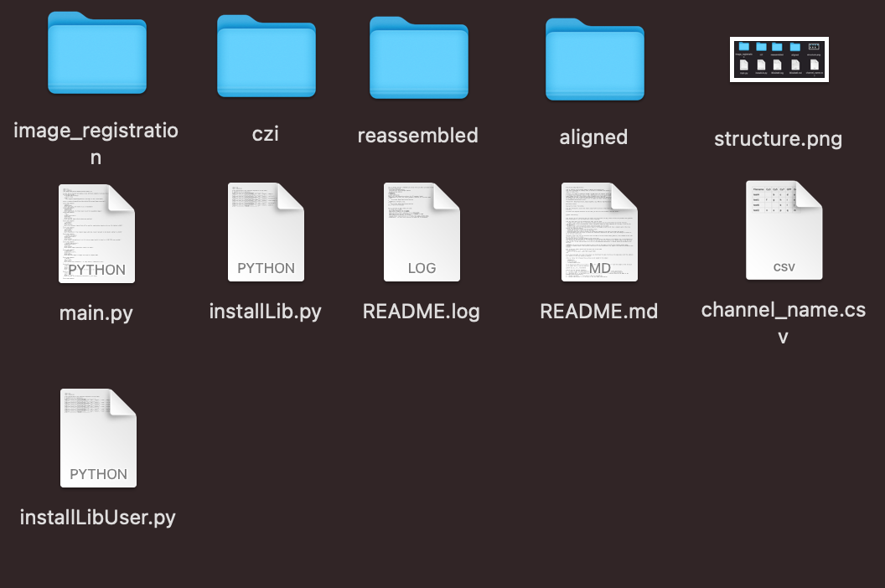

# Microscopy Image Processing

Prototype to register czi microscopy images with **python 3**.
This code is optimised at a memory level to be able to stitch and register high resolution images in **ome.tif**.

## Getting started

Download the folder from Github and from the **terminal**, access that folder.

To install the required librairies for the code, you can run:

```
python3 installLib.py
```

This installs all the librairies that you require for the process (via pip, which is built-in by default with python3). 
After having done so, you can remove this script if desired.

From the folder where you are launching the code, you will have:
- a folder **czi**, where the czi files that you want to process will be stored (which will be the "source")
- an EMPTY folder called **stitched** (where stitched images and image dimension will be save, it will be the "destination")
- an EMPTY folder called **aligned** (where registered images will be saved).

Here is how your folder should look like where you run the code:
<p align="center">
  
</p>

If you have downloaded the folder from Github, you should have the same structure as the image above (with the addition of a couple of files that should be removed).

**Please remove the following files as they are not needed for the code**:

- **README.md**
- **structure.png**
- ./czi/**empty.txt**
- ./aligned/**empty.txt**
- ./stitched/**image_shape.txt**


**WARNING:** If you are running a new set of czi, it is important that the conditions previously mentioned are met (meaning: stitched folder is empty, aligned folder is empty and czi folder has only the czis you want to process). Else "old" files will be read with the new ones.

Currently, for images of dimension 16'000 x 21'000 pixels the computer uses a maximum of 52GB to run all the code.
I recommend these dimensions (give or take 1000 pixels) if you are using a 64GB RAM computer. 

**WARNING 2:** It is important that in your CZI files the reference channel (in our case dapi) is the last channel of your image stack.

To run main.py you need to run at least the 2 arguments "source" and "destination" (with the example of the structure in the image, which is what you downloaded):
```
python3 main.py ./czi ./stitched
```
main.py has also 6 optional arguments:
1. -y, --yes --> runs the code without asking questions before stitching and before registration
2. --disable-stitching --> if you want to only stitch
3. --disable-registration --> if you want to only do image registeration
4. -d, --downscale --> if you want to reduce the resolution of your image (default is 0.33) if you image is too big.
5. --factor 0.XX --> the downscale factor you want between 0 and 1 ( the argument --downscale is required else it is full resolution that is done)
6. --finalimage --> if you want to save the final image containing all the channels without dapis except for the dapi used as reference for registration

if you want more information on the arguments run
```
python3 main.py --help
```

## What does the code do

It is important to note that the loading of the file paths are done in alphanumerical order. So if you have over 9 rounds of images counting 1,2,...,10; 10 could be used first. To avoid this problem, the numbers should be written 01,02,...10. Like this the order will be alphanumerically.

**STITCHING**
1. Load the czi file paths
2. Take one czi file and stitch the image
3. Save the dimensions of the image in a txt file called "images_shape.txt" in the "destination" folder(at the start the .txt should not exist and the program will create it)
4. Save the stitched image in ome.tif in the "destination" folder
5. Restart from step 2 for the next czi file.

**IMAGE REGISTRATION**
1. Load the first image in the list which will be used as the reference
2. Extract last channel which is used to align (in our case DAPI)
3. Delete other channels
4. Load the next image i and extract last channel used to align (delete other channels)
5. Pad if needed
6. Rescale if asked in command line
7. Do image registration on dapi_ref and dapi_i using pystackreg library
8. Transform the other channels of image i with the known transformation
9. Save the registered images in ome.tif into the folder aligned.
10. Restart from step 4. with the next image

**FINAL IMAGE**
1. Loads the first image into an array
2. Loads the next image and removes dapi
3. Repeat step 2 until the end
4. Final image is saved in ome.tif in the main folder where you run the code.


